## Disclaimer

1. We are autodidacts 
2. What we present here works for us
3. Read and follow the official [Google Chart API documentation](https://developers.google.com/chart/) and [Terms of Service](https://developers.google.com/readme/terms)
4. Sometimes you have to re-load this presentation for the charts and all slides to appear

---

## Agenda

* Introduction and motivation
* Google Chart Tools
* R package googleVis
  * Concepts of googleVis
  * Case studies
* googleVis on shiny  

```{r setOptions, echo=FALSE}
options(gvis.plot.tag="chart")
```


--- .segue .dark

## Introduction and motivation

--- .class #id 

## Hans Rosling: No more boring data

<iframe width="420" height="315" src="http://www.youtube.com/embed/hVimVzgtD6w" frameborder="0" allowfullscreen></iframe>

---

## Motivation for googleVis

* Inspired by Hans Rosling’s talks we wanted to use interactive data visualisation tools to foster the dialogue between data analysts and others

* We wanted moving bubbles charts as well

* The software behind Hans’ talk was bought by Google and integrated as motion charts into their Visualisation API

* Ideally we wanted to use R, a language we knew

* Hence, we had to create an interface between the Google Chart Tools and R

--- .segue .dark

## Google Chart Tools

---

## Introduction to Google Chart Tools

* Google Chart Tools provide a way to visualize data on web sites

* The API makes it easy to create interactive charts

* It uses JavaScript and DataTable / JSON as input

* Output is either HTML5/SVG or Flash

* Browser with internet connection required to display chart

* Please read the Google [Terms of Service](https://developers.google.com/terms/) before you start

---

## Structure of Google Charts

The chart code has five generic parts:

1. References to Google’s AJAX and Visualisation API
2. Data to visualize as a DataTable
3. Instance call to create the chart
4. Method call to draw the chart including options
5. HTML &lt;div&gt; element to add the chart to the page

---

## How hard can it be?

* Transform data into JSON object 
* Wrap some HTML and JavaScript around it 
* Thus, googleVis started life in August 2010


----

## Motion chart example

```{r motionchartcode, results='asis'}
suppressPackageStartupMessages(library(googleVis))
plot(gvisMotionChart(Fruits, "Fruit", "Year",
                     options=list(width=600, height=400)))
```


--- .segue .dark

## R package googleVis 

--- 

## Overview of googleVis

* [googleVis](http://code.google.com/p/google-motion-charts-with-r/) is a package for [R](http://www.r-poject.org/) and provides an interface between R and the [Google Chart Tools](https://developers.google.com/chart/)

* The functions of the package allow users to visualize data with the Google Chart Tools without uploading their data to Google

* The output of googleVis functions is html code that contains the data and references to JavaScript functions hosted by Google

* To view the output a browser with an internet connection is required, the actual chart is rendered in the browser; some charts require Flash

* See also: **Using the Google Visualisation API with R**, 
  [The R Journal, 3(2):40-44, December 2011](http://journal.r-project.org/archive/2011-2/RJournal_2011-2_Gesmann+de~Castillo.pdf) and googleVis [package vignette](http://cran.r-project.org/web/packages/googleVis/vignettes/googleVis.pdf)

---

## googleVis version 0.4.3 provides interfaces to 

* Flash based
  * Motion Charts
  * Annotated Time Lines
  * Geo Maps
* HMTL5/SVG based
  * Maps, Geo Charts and Intensity Maps
  * Tables, Gauges, Tree Maps
  * Line-, Bar-, Column-, Area- and Combo Charts
  * Scatter-, Bubble-, Candlestick-, Pie- and Org Charts

Run ```demo(googleVis)``` to see [examples](http://code.google.com/p/google-motion-charts-with-r/wiki/GadgetExamples) of all charts and read the [vignette](http://cran.r-project.org/web/packages/googleVis/vignettes/googleVis.pdf) for more details.

----

## Key ideas of googleVis

* Create wrapper functions in R which generate html files with references to Google's Chart Tools API
* Transform R data frames into [JSON](http://www.json.org/) objects with [RJSONIO](http://www.omegahat.org/RJSONIO/)

```{r}
library(RJSONIO)
dat <- data.frame(x=LETTERS[1:2], y=1:2)
cat(toJSON(dat)) 
```
* Display the HTML output with the R HTTP help server

---

## The googleVis concept

* Charts: *'gvis' + ChartType*
* For a motion chart we have

```{r eval=FALSE, tidy=FALSE}
M <- gvisMotionChart(data, idvar='id', timevar='date', 
                     options=list(), chartid)
```

* Output of googleVis is a list of list

* Display the chart by simply plotting the output: ```plot(M)```
* Plot will generate a temporary html-file and open it in a new browser window 
* Specific parts can be extracted, e.g. 
  * the chart: ```M$html$chart``` or 
  * data: ```M$html$chart["jsData"]```

---

## gvis-Chart structure

List structure:


---


## Line chart with options set

```{r results='asis', tidy=FALSE}
df <- data.frame(label=c("US", "GB", "BR"), val1=c(1,3,4), val2=c(23,12,32))
Line <- gvisLineChart(df, xvar="label", yvar=c("val1","val2"),
        options=list(title="Hello World", legend="bottom",
                titleTextStyle="{color:'red', fontSize:18}",                         
                vAxis="{gridlines:{color:'red', count:3}}",
                hAxis="{title:'My Label', titleTextStyle:{color:'blue'}}",
                series="[{color:'green', targetAxisIndex: 0}, 
                         {color: 'blue',targetAxisIndex:1}]",
                vAxes="[{title:'Value 1 (%)', format:'##,######%'}, 
                                  {title:'Value 2 (\U00A3)'}]",                          
                curveType="function", width=500, height=300                         
                ))
```
Options in googleVis have to follow the Google Chart API options

---

## Line chart with options
```{r results='asis'}
plot(Line)
```

---

## On-line changes

You can enable the chart editor which allows users to change the chart.
```{r results='asis'}
plot(gvisLineChart(df, options=list(gvis.editor="Edit me!", height=350)))
```

---

## Change motion chart settings

```{r results='asis'}
plot(gvisMotionChart(Fruits, "Fruit", "Year", 
                     options=list(width=500, height=350)))
```
Change displaying settings via the browser, then copy the state string from the 'Advanced' tab and set to `state` argument in `options`.
Ensure you have newlines at the beginning and end of the string. 

---

## Motion chart with initial settings changed

```{r results='asis', tidy=FALSE}
myStateSettings <- '\n{"iconType":"LINE", "dimensions":{
    "iconDimensions":["dim0"]},"xAxisOption":"_TIME",
    "orderedByX":false,"orderedByY":false,"yZoomedDataMax":100}\n'
plot(gvisMotionChart(Fruits, "Fruit", "Year", 
      options=list(state=myStateSettings, height=320)))
```

---

## Displaying geographical information

Plot countries' S&P credit rating sourced from Wikipedia (requires googleVis 0.4.3)
```{r tidy=FALSE}
library(XML)
url <- "http://en.wikipedia.org/wiki/List_of_countries_by_credit_rating"
x <- readHTMLTable(readLines(url), which=3)
levels(x$Rating) <- substring(levels(x$Rating), 4, 
                            nchar(levels(x$Rating)))
x$Ranking <- x$Rating
levels(x$Ranking) <- nlevels(x$Rating):1
x$Ranking <- as.character(x$Ranking)
x$Rating <- paste(x$Country, x$Rating, sep=": ")
G <- gvisGeoChart(x, "Country", "Ranking", hovervar="Rating",
                options=list(gvis.editor="S&P",
                             projection="kavrayskiy-vii",
                             colorAxis="{colors:['#91BFDB', '#FC8D59']}"))
```

---

## Chart countries' S&P credit rating
```{r results='asis'}
plot(G)
```

---

## Geo chart with markers
Display earth quake information of last 30 days
```{r results='asis', tidy=FALSE}
library(XML)
eq <- read.csv("http://earthquake.usgs.gov/earthquakes/feed/v0.1/summary/2.5_week.csv")
eq$loc=paste(eq$Latitude, eq$Longitude, sep=":")

G <- gvisGeoChart(eq, "loc", "Depth", "Magnitude",
                   options=list(displayMode="Markers", 
                   colorAxis="{colors:['purple', 'red', 'orange', 'grey']}",
                   backgroundColor="lightblue"), chartid="EQ")
````

---

## Geo chart of earth quakes
```{r results='asis', tidy=FALSE}
plot(G)
```

---

## Org chart
```{r results='asis', tidy=FALSE}
Org <- gvisOrgChart(Regions, options=list(width=600, height=250,
                               size='large', allowCollapse=TRUE))
plot(Org)
```

---

## Org chart data
```{r}
Regions
```
Notice the data structure. Each row in the data table describes one node. Each node (except the root node) has one or more parent nodes. 

---


## Tree map
Same data structure as for org charts required.
```{r results='asis'}
Tree <- gvisTreeMap(Regions,  idvar="Region", parentvar="Parent",
                    sizevar="Val", colorvar="Fac",
                    options=list(width=450, height=320))
plot(Tree)
```

---

## Annotated time line data
Display time series data with notes.
```{r}
head(Stock)
```

---

## Annotated time line

```{r results='asis', eval=FALSE}
A1 <- gvisAnnotatedTimeLine(Stock, datevar="Date",
                           numvar="Value", idvar="Device",
                           titlevar="Title", annotationvar="Annotation",
                           options=list(displayAnnotations=TRUE,
                            legendPosition='newRow',
                            width=600, height=300), chartid="ATLC"
                           )
plot(A1)
```
<iframe src="https://dl.dropboxusercontent.com/u/7586336/googleVisExamples/AnnotatedTimeLineExample.html" frameborder="0", width="620", height="350">Loading</iframe>

---

## Merging gvis-objects

```{r results='asis', tidy=FALSE}
G <- gvisGeoChart(Exports, "Country", "Profit", 
                  options=list(width=250, height=120))
B <- gvisBarChart(Exports[,1:2], yvar="Profit", xvar="Country",                  
                  options=list(width=250, height=260, legend='none'))
M <- gvisMotionChart(Fruits, "Fruit", "Year",
                     options=list(width=400, height=380))
GBM <- gvisMerge(gvisMerge(G,B, horizontal=FALSE), 
                 M, horizontal=TRUE, tableOptions="cellspacing=5")
```

---

## Display merged gvis-objects
```{r merged, results='asis', eval=FALSE}
plot(GBM)
```
<iframe src="https://dl.dropboxusercontent.com/u/7586336/googleVisExamples/gvisMergeExample.html" frameborder="0", width="620", height="420">Loading</iframe>

---

## Embedding googleVis chart into your web page

Suppose you have an existing web page and would like to integrate the output of a googleVis function, such as ```gvisMotionChart```.

In this case you only need the chart output from ```gvisMotionChart```. So you can either copy and paste the output from the R console

```{r eval=FALSE}
 print(M, 'chart') #### or cat(M$html$chart)
```
into your existing html page, or write the content directly into a file

```{r eval=FALSE}
print(M, 'chart', file='myfilename')
```
and process it from there.

---

## Embedding googleVis output via iframe

* Embedding googleVis charts is often easiest done via the iframe tag:
* Host the googleVis output on-line, e.g. public Dropbox folder
* Use the iframe tag on your page:

```
<iframe width=620 height=300 frameborder="0"
src="http://dl.dropbox.com/u/7586336/RSS2012/line.html">
Your browser does not support iframe
</iframe>
```

---

## iFrame output

<iframe width=620 height=300 frameborder="0" src="http://dl.dropbox.com/u/7586336/RSS2012/line.html">You browser does not support iframe</iframe>

---

## Including googleVis output in knitr with plot statement

* With version 0.3.2 of googleVis `plot.gvis` gained the argument `'tag'`, which works similar to the argument of the same name in `print.gvis`. 

* By default the tag argument is `NULL` and `plot.gvis` has the same behaviour as in the previous versions of googleVis. 

* Change the tag to `'chart'` and `plot.gvis` will produce the same output as `print.gvis`. 

* Thus, setting the `gvis.plot.tag` value to `'chart'` in `options()` will return the HTML code of the chart when the file is parsed with `knitr`. 

* See the example in `?plot.gvis` for more details

--- .segue .dark

## googleVis on shiny

---
## Introduction to shiny

* R Package shiny from RStudio supplies:
  * interactive web application  / dynamic HTML-Pages with plain R
  * GUI for own needs
  * Website as server

---

## What makes shiny special ?

* very simple: ready to use components (widgets)
* event-driven (reactive programming): input <-> output
* communication bidirectional with web sockets (HTTP)
* JavaScript with JQuery (HTML) 
* CSS with bootstrap

---

## Getting started: Setup

1. ```R> install.packages("shiny")``` from CRAN
2. Create directory ```HelloShiny``` 
3. Edit ```global.r```
4. Edit ```ui.r```
5. Edit ```server.r```
6. ```R> shiny::runApp("HelloShiny")```

---

## Getting started: global.R

This file contains global variables, libraries etc.  [optional]

```{r global, eval=FALSE}
## E.g.
library(googleVis)
library(Cairo)
The_Answer <- 42
```

---

## Getting started: server.R


The Core Component with functionality for input and output as plots, 
tables and plain text.

```{r server, eval=FALSE, tidy=FALSE}
shinyServer(function(input, output) {
       output$distPlot <- renderPlot({
         dist <- rnorm(input$obs)
         hist(dist)
         })
})
```

---

## Getting started: ui.R

This file creates the structure of HTML

```{r ui, eval=FALSE, tidy=FALSE}
shinyUI(pageWithSidebar(
   headerPanel("Example Hello Shiny"),
   sidebarPanel(
      sliderInput("obs",  "", 0, 1000, 500)
   ),
   mainPanel(
      plotOutput("distPlot")
   )
))
```

---

## Getting strated: runApp

```R> shiny::runApp('HelloShiny')```

<iframe src="http://glimmer.rstudio.com/mages/HelloShiny/" width="100%" 
height="100%" frameborder="0">Loading</iframe>

---

## Details for ui.r / part 1

Ready-to-Use widgets for input parameter:

- selectInput
- checkboxInput
- numericInput
- sliderInput
- textInput
- radioButtons

---

## Details for ui.r / part 2

Elements for structural usage:

- conditionalPanel
- tabsetPanel + tabPanel
- includeMarkdown

---

## Details for server.r

output components:

- renderPlot
- renderPrint
- renderGvis 
- renderTable

additional compontents:
- downloadHandler
- fileInput

---

## Example 1: Select data for a scatter chart

<iframe src="http://glimmer.rstudio.com/mages/LancasterExample_1/" width="100%" 
height="100%" frameborder="0">Loading</iframe>


---

## Example 1: server.R

```{r exmpl1_server, eval=FALSE}
# Contributed by Joe Cheng, February 2013  
# Requires googleVis version 0.4 and shiny 0.4 or greater
library(googleVis)

shinyServer(function(input, output) {
  datasetInput <- reactive({
    switch(input$dataset,
           "rock" = rock,
           "pressure" = pressure,
           "cars" = cars)
  })  
  output$view <- renderGvis({ # instead of renderPlot
    gvisScatterChart(datasetInput(), options=list(width=400, height=400))
  })
})
```


---

## Example 1: ui.R

```{r exmpl1_ui, eval=FALSE, tidy=FALSE}
shinyUI(pageWithSidebar(
  headerPanel("Example 1: scatter chart"),
  sidebarPanel(
    selectInput("dataset", "Choose a dataset:", 
                choices = c("rock", "pressure", "cars"))
  ),
  mainPanel(
    htmlOutput("view") ## not plotOut!
  )
))
```

---


## Example 2: Interactive table

<iframe src="http://glimmer.rstudio.com/mages/LancasterExample_2/" width="100%" 
height="100%" frameborder="0">Loading</iframe>

---

## Example 2: server.R
```{r exmpl2_server, eval=FALSE, tidy=FALSE}
# Diego de Castillo, February 2013
library(datasets)
library(googleVis)
shinyServer(function(input, output) {
  myOptions <- reactive({
    list(
      page=ifelse(input$pageable==TRUE,'enable','disable'),
      pageSize=input$pagesize,
      height=400
    )
  })
  output$myTable <- renderGvis({
    gvisTable(Population[,1:5],options=myOptions())         
  })
})
```

---

## Example 2: ui.R

```{r exmpl2_ui, eval=FALSE, tidy=FALSE}
shinyUI(pageWithSidebar(
  headerPanel("Example 2: pageable table"),
  sidebarPanel(
    checkboxInput(inputId = "pageable", label = "Pageable"),
    conditionalPanel("input.pageable==true",
                     numericInput(inputId = "pagesize",
                                  label = "Countries per page",10))    
  ),
  mainPanel(
    htmlOutput("myTable")
  )
))
```

---

## Example 3: Animated geo chart

<iframe src="http://glimmer.rstudio.com/mages/LancasterExample_3/" width="100%" 
height="100%" frameborder="0">Loading</iframe>

---

## Example 3: global.R

```{r exmpl3_loaddata, eval=FALSE, tidy=FALSE}
## Markus Gesmann, February 2013
## Prepare data to be displayed
## Load presidential election data by state from 1932 - 2012
dat <- read.csv("http://dl.dropboxusercontent.com/u/7586336/blogger/US%20Presidential%20Elections.csv", 
                stringsAsFactors=TRUE)


## Add min and max values to the data
datminmax = data.frame(state=rep(c("Min", "Max"),21), 
                       demVote=rep(c(0, 100),21),
                       year=sort(rep(seq(1932,2012,4),2)))
dat <- rbind(dat[,1:3], datminmax)
require(googleVis)
```

---

## Example 3: server.R
```{r exmpl3_server, eval=FALSE, tidy=FALSE}
shinyServer(function(input, output) {
  myYear <- reactive({
    input$Year
  })
  output$year <- renderText({
    paste("Democratic share of the presidential vote in", myYear())
  })
  output$gvis <- renderGvis({
    myData <- subset(dat, (year > (myYear()-1)) & (year < (myYear()+1)))
    gvisGeoChart(myData,
                 locationvar="state", colorvar="demVote",
                 options=list(region="US", displayMode="regions", 
                              resolution="provinces",
                              width=400, height=380,
                              colorAxis="{colors:['#FFFFFF', '#0000FF']}"
                 ))     
    })
})
```

---

## Example 3: ui.R

```{r exmpl3_ui, eval=FALSE, tidy=FALSE}
shinyUI(pageWithSidebar(
  headerPanel("Example 3: animated geo chart"),
  sidebarPanel(
    sliderInput("Year", "Election year to be displayed:", 
                min=1932, max=2012, value=2012,  step=4,
                format="###0",animate=TRUE)
  ),
  mainPanel(
    h3(textOutput("year")), 
    htmlOutput("gvis")
  )
))
```

---

## Example 4: googleVis with interaction

<iframe src="http://glimmer.rstudio.com/mages/Interaction/" width="100%" 
height="100%" frameborder="0">Loading</iframe>


---

## Example 4: server.R / part 1

```{r exmpl4_server1, eval=FALSE, tidy=FALSE}
require(googleVis)
shinyServer(function(input, output) {
  datasetInput <- reactive({
    switch(input$dataset, "pressure" = pressure, "cars" = cars)
  })
  output$view <- renderGvis({    
    jscode <- "var sel = chart.getSelection();
    var row = sel[0].row;
    var text = data.getValue(row, 1);               
    $('input#selected').val(text);
    $('input#selected').trigger('change');"    
    gvisScatterChart(data.frame(datasetInput()),
                     options=list(gvis.listener.jscode=jscode,
                                  height=200, width=300))
    
  })
```

---

## Example 4: server.R / part 2

```{r exmpl4_server2, eval=FALSE, tidy=FALSE}
  output$distPlot <- renderPlot({
    if (is.null(input$selected))
      return(NULL)
    
    dist <- rnorm(input$selected)
    hist(dist,main=input$selected)
  })
  
  output$selectedOut <- renderUI({
    textInput("selected", "", value="10")
  })
  outputOptions(output, "selectedOut", suspendWhenHidden=FALSE)   
})
```

---

## Example 4: ui.R

```{r exmpl4_ui, eval=FALSE, tidy=FALSE}
require(googleVis)
shinyUI(pageWithSidebar(
  headerPanel("", windowTitle="Example googleVis with interaction"),
  sidebarPanel(
    tags$head(tags$style(type='text/css', "#selected{ display: none; }")),
    selectInput("dataset", "Choose a dataset:", 
                choices = c("pressure", "cars")),
    uiOutput("selectedOut")
  ),
  mainPanel(
    tabsetPanel(
      tabPanel("Main",
               htmlOutput("view"),
               plotOutput("distPlot", width="300px", height="200px")),
      tabPanel("About", includeMarkdown('README.md')
      ))))
)
```

--- 

## Reactive model

Three objects build the framework:

* reactive source     [selectInput] 
  

* reactive conductor  [db-connect / calculate]
  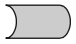

* reactive endpoint    [renderPlot/renderTable]
  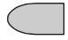

---

## Reactive model

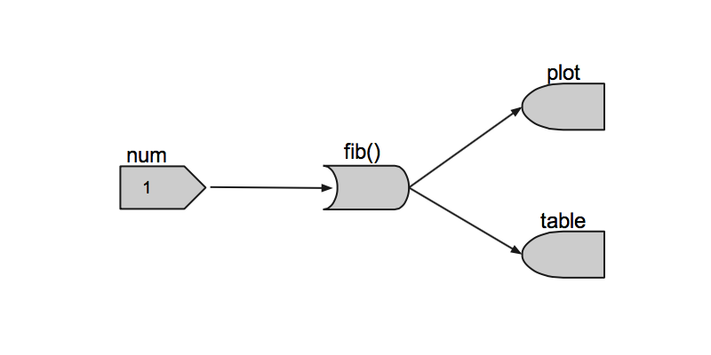

---

## Reactive model

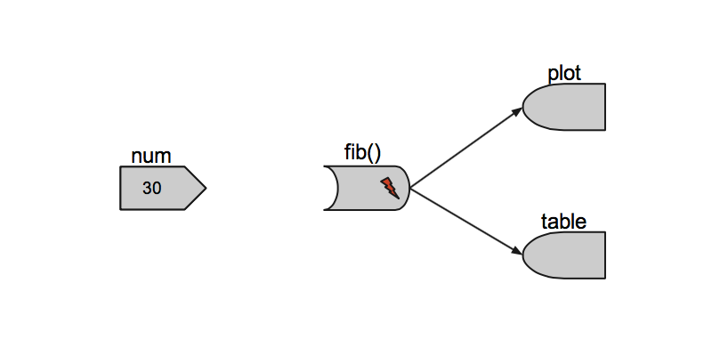

---

## Reactive model

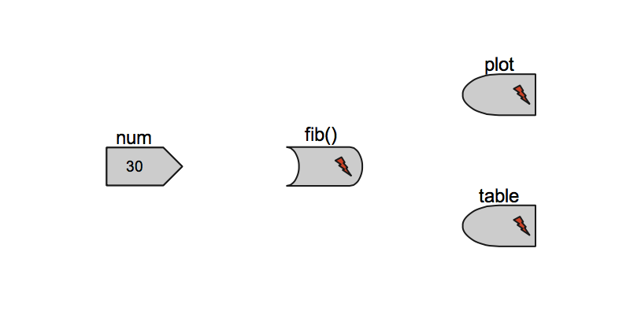

---

## Reactive model

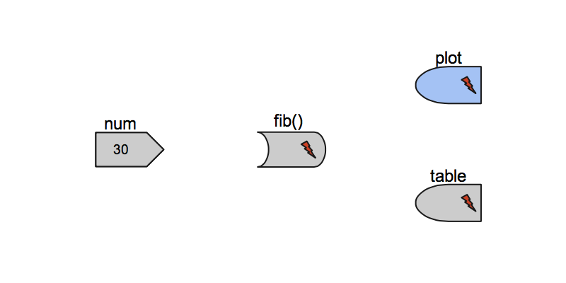

---

## Reactive model

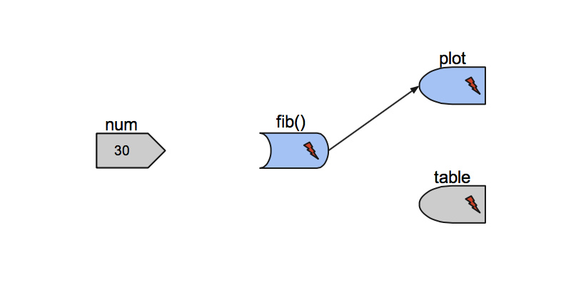

---

## Reactive model

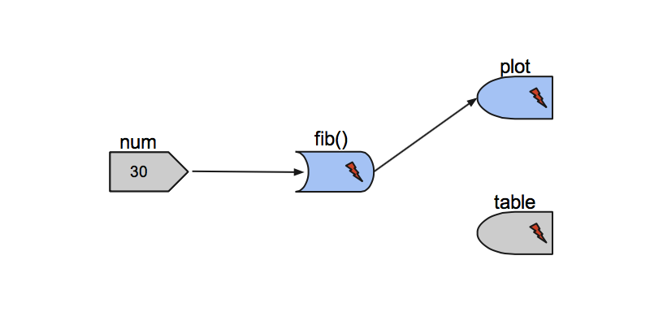

---

## Reactive model

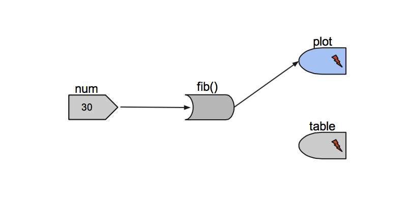

---

## Reactive model

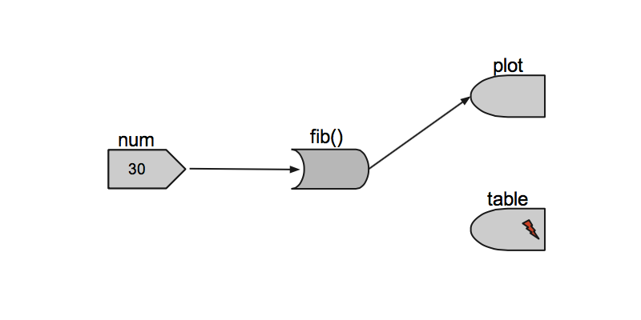

---

## Reactive model

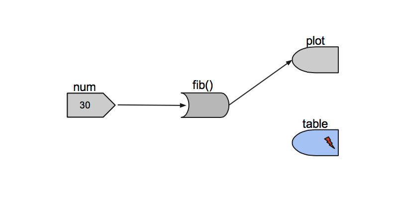

---

## Reactive model

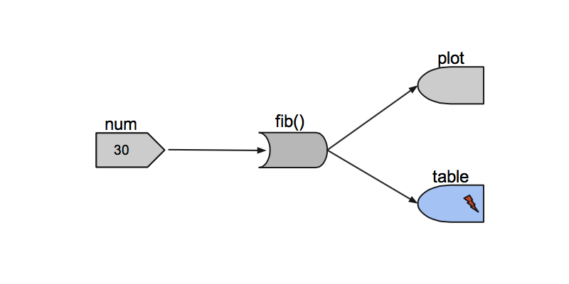

---

## Reactive model


---

## Further reading and examples

* [Shiny by RStudio](http://www.rstudio.com/shiny/)
* [First steps with googleVis on shiny](http://lamages.blogspot.co.uk/2013/02/first-steps-of-using-googlevis-on-shiny.html)
* [RStudio Glimmer Server](http://glimmer.rstudio.com:8787)
* [BI Dashbord with shiny and rCharts](http://glimmer.rstudio.com/reinholdsson/shiny-dashboard/)
* [Shiny examples with slidify](https://github.com/ramnathv/shinyExamples)
* [Shiny on R-Bloggers](http://www.r-bloggers.com/?s=shiny)


--- .segue .dark

## The End. Questions? 

----

## How we created these slides

```{r slidify, eval=FALSE}
library(slidify)
author("googleVis_Tutorial")
## Edit the file index.Rmd file and then
slidify("index.Rmd")
```

---


## Blog articles with googleVis tips

* [How to set axis options in googleVis](http://lamages.blogspot.co.uk/2013/04/how-to-set-axis-options-in-googlevis.html)
* [World Bank data demo](http://lamages.blogspot.co.uk/2013/03/googlevis-042-with-support-for-shiny.html)
* [First steps of using googleVis on shiny](http://lamages.blogspot.co.uk/2013/02/first-steps-of-using-googlevis-on-shiny.html)
* [Using googleVis with knitr](http://lamages.blogspot.co.uk/2012/10/googlevis-032-is-released-better.html)
* [Rook rocks! Example with googleVis](http://lamages.blogspot.co.uk/2012/08/rook-rocks-example-with-googlevis.html)
* [Plotting share price data](http://lamages.blogspot.co.uk/2012/02/reshaping-world.html)

---

## Other R packages

* [R animation package allows to create SWF, GIF and MPEG directly](http://animation.yihui.name/)
* [iplots: iPlots - interactive graphics for R](http://cran.r-project.org/web/packages/iplots/)
* [Acinonyx aka iPlots eXtreme](http://rforge.net/Acinonyx/index.html)
* [gridSVG: Export grid graphics as SVG](http://cran.r-project.org/web/packages/gridSVG/index.html)
* [plotGoogleMaps: Plot HTML output with Google Maps API and your own data](http://cran.r-project.org/web/packages/plotGoogleMaps/)
* [RgoogleMaps: Overlays on Google map tiles in R](http://cran.r-project.org/web/packages/RgoogleMaps/index.html)
* [rCharts](http://ramnathv.github.io/rCharts/)
* [clickme](https://github.com/nachocab/clickme)

---

## Thanks

* Google, who make the visualisation API available
* All the guys behind www.gapminder.org and Hans Rosling for telling
    everyone that data is not boring 
* Sebastian Perez Saaibi for his inspiring talk on 'Generator
    Tool for Google Motion Charts' at the R/RMETRICS conference 2010
* Henrik Bengtsson for providing the 'R.rsp: R Server Pages'
    package and his reviews and comments
* Duncan Temple Lang for providing the 'RJSONIO' package
* Deepayan Sarkar for showing us in the lattice package how to deal
    with lists of options  
* Paul Cleary for a bug report on the handling of months:
    Google date objects expect the months Jan.- Dec. as 0 - 11 and
    not 1 - 12.
* Ben Bolker for comments on plot.gvis and the usage of temporary
    files  


---

## Thanks 

* John Verzani for pointing out how to use the R http help server
* Cornelius Puschmann and Jeffrey Breen for highlighting a
    dependency issue with RJONSIO version 0.7-1
* Manoj Ananthapadmanabhan and Anand Ramalingam for providing
    ideas and code to animate a Google Geo Map
* Rahul Premraj for pointing out a rounding issue with Google Maps 
* Mike Silberbauer for an example showing how to shade the
    areas in annotated time line charts
* Tony Breyal for providing instructions on changing the Flash
    security settings to display Flash charts locally 
* Alexander Holcroft for reporting a bug in gvisMotionChart
    when displaying data with special characters in column names
* Pat Burns for pointing out typos in the vignette

---

## Thanks

* Jason Pickering for providing a patch to allow for quarterly 
    and weekly time dimensions to be displayed with gvisMotionChart
* Oliver Jay and Wai Tung Ho for reporting an issue with one-row 
    data sets
* Erik Bülow for pointing out how to load the Google API via a
    secure connection
* Sebastian Kranz for comments to enhance the argument list for
    gvisMotionChart to make it more user friendly 
* Sebastian Kranz and Wei Luo for providing ideas and code to
    improve the transformation of R data frames into JSON code
* Sebastian Kranz for reporting a bug in version 0.3.0
* Leonardo Trabuco for helping to clarify the usage of the
    argument state in the help file of gvisMotionChart
* Mark Melling for reporting an issue with jsDisplayChart and
    providing a solution

---

## Thanks

* Joe Cheng for code contribution to make googleVis work with shiny
* John Maindonald for reporting that the WorldBank demo didn't 
    download all data, but only the first 12000 records.
* Sebastian Campbell for reporting a typo in the Andrew and Stock
    data set and pointing out that the core charts, such as line
  charts accept also date variables for the x-axis. 
* John Maindonald for providing a simplified version of the
    WorldBank demo using the WDI package.
* John Muschelli for suggesting to add 'hovervar' as an additional
    argument to gvisGeoChart.
* [Ramnath Vaidyanathan](https://github.com/ramnathv) for slidify.

---
## Session Info

```{r sessionInfo2}
sessionInfo()
```